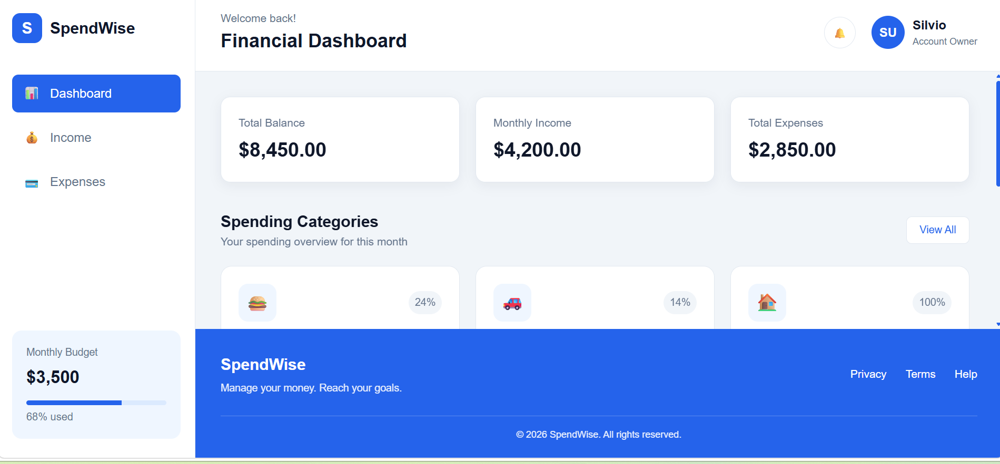

# SpendWise Dashboard Shell

## Project Overview

SpendWise is a responsive personal finance dashboard designed to help users view and understand their spending in different financial categories.

This project is the foundation of a larger Personal Budget & Expense Tracker capstone project. For this stage, the focus is on creating the visual dashboard structure using **HTML and modern CSS techniques**.

The dashboard contains a sidebar navigation, header, financial summary cards, spending category cards, and a responsive footer.

---

## Features

* Responsive dashboard layout
* Sidebar navigation menu
* Dashboard header with user profile
* Financial summary section
* Six spending category cards
* Monthly budget progress indicator
* Responsive footer
* CSS Grid layout
* CSS Flexbox layout
* CSS custom properties
* Card hover animations
* Keyboard focus animations
* Responsive mobile layout
* Dark theme using `prefers-color-scheme`

---

## Spending Categories

The dashboard includes six realistic financial categories:

1. Food
2. Transport
3. Rent
4. Entertainment
5. Savings
6. Utilities

Each card displays:

* Category name
* Category description
* Amount spent
* Category budget
* Percentage used
* Progress bar

---

## Technologies Used

* HTML5
* CSS3
* CSS Grid
* CSS Flexbox
* CSS Custom Properties
* CSS Media Queries
* CSS Transitions
* Responsive Web Design

No JavaScript is required for this stage because the assignment focuses on the visual structure of the dashboard.

---

## Layout Structure

The main dashboard uses **CSS Grid** to create the overall page layout.

```text
SpendWise Dashboard
│
├── Sidebar
│   ├── Logo
│   ├── Dashboard
│   ├── Income
│   └── Expenses
│
└── Main Content
    ├── Header
    ├── Financial Summary
    ├── Spending Categories
    │   ├── Food
    │   ├── Transport
    │   ├── Rent
    │   ├── Entertainment
    │   ├── Savings
    │   └── Utilities
    │
    └── Footer
```

Flexbox is used inside the sidebar, header, summary cards, category cards, and footer to arrange individual elements.

---

## CSS Custom Properties

The project uses CSS variables to create a consistent theme.

Examples include:

```css
:root {
    --brand-color: #2563eb;
    --accent-color: #14b8a6;
    --surface-color: #ffffff;
    --background-color: #f1f5f9;
    --primary-text: #0f172a;
    --secondary-text: #64748b;
}
```

Using CSS custom properties makes it easier to maintain and change the dashboard's color theme.

---

## Responsive Design

The dashboard is responsive and adapts to smaller screens using a CSS media query.

Below **768px**, the dashboard changes to a single-column layout.

The mobile layout:

* Stacks the dashboard content vertically
* Adjusts the navigation
* Changes the category grid to one column
* Adjusts the header
* Makes the footer responsive
* Reduces spacing and font sizes where necessary

The responsive layout was tested using the browser's **DevTools Device Toolbar**.

---

## Card Micro-interactions

The category cards include subtle animations for better user experience.

The animations apply to both:

* Mouse hover
* Keyboard focus

The transition lasts **200ms**, which is below the required 250ms limit.

Example:

```css
.category-card:hover {
    transform: translateY(-4px);
    box-shadow: 0 10px 25px rgba(15, 23, 42, 0.12);
}

.category-card:focus {
    transform: translateY(-4px);
    box-shadow: 0 10px 25px rgba(15, 23, 42, 0.12);
}
```

The cards also use `tabindex="0"` so they can receive keyboard focus.

---

## Dark Theme

As a stretch goal, SpendWise supports a dark theme using:

```css
@media (prefers-color-scheme: dark)
```

The dark theme overrides the CSS custom properties so the dashboard can automatically adapt to the user's system color preference.

---

## Project Files

```text
SpendWise/
│
├── index.html
├── style.css
└── README.md
```

### `index.html`

Contains the structure and static content of the dashboard.

### `style.css`

Contains all styling, including:

* Grid layout
* Flexbox layout
* Colors
* Typography
* Responsive design
* Card animations
* Dark theme
* Footer styling

### `README.md`

Contains information about the project, technologies used, layout structure, and responsive implementation.

---

## How to Run the Project

1. Download or clone the project repository.
2. Open the project folder in VS Code.
3. Open `index.html` in a web browser.

You can also use the **Live Server** extension in VS Code for easier development.

---

## Responsive Testing

To test the mobile layout:

1. Open the dashboard in Google Chrome.
2. Press `F12` to open Developer Tools.
3. Click the **Device Toolbar** icon.
4. Select a mobile device.
5. Confirm that the viewport width is below `768px`.
6. Check that the dashboard changes to a single-column layout.

---

## Screenshots

### Desktop View

Add your desktop dashboard screenshot here:




```markdown


```

### Mobile View

Add your DevTools mobile screenshot here:


```markdown

```

### Dark Theme

If you capture a dark-theme screenshot, you can add:

```markdown

```

---

## Future Improvements

This dashboard is currently a visual shell. Future versions of SpendWise can add:

* Add and delete expenses
* Income tracking
* Budget management
* Expense filtering
* Data visualization and charts
* Local storage
* User authentication
* Database integration
* Monthly reports
* Expense search
* JavaScript functionality

---

## Author

**Silvio**

SpendWise Personal Budget & Expense Tracker

Built as part of a progressive web development capstone project.
